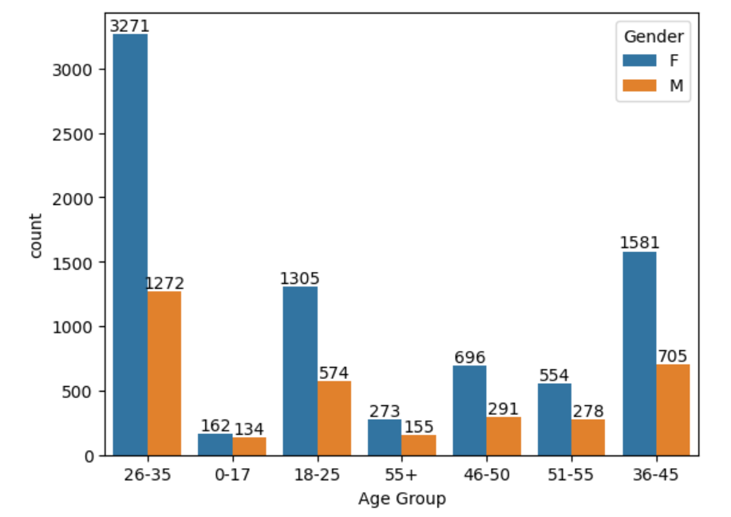
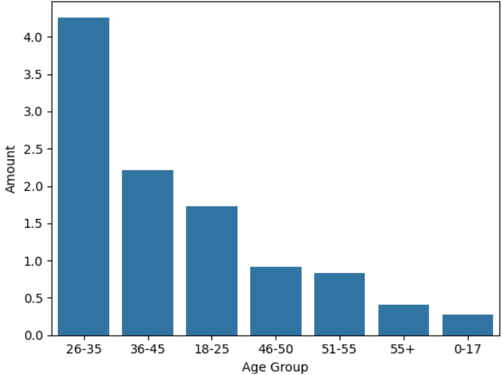
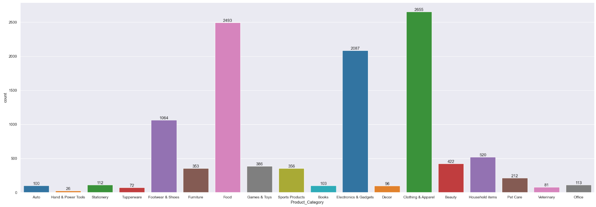
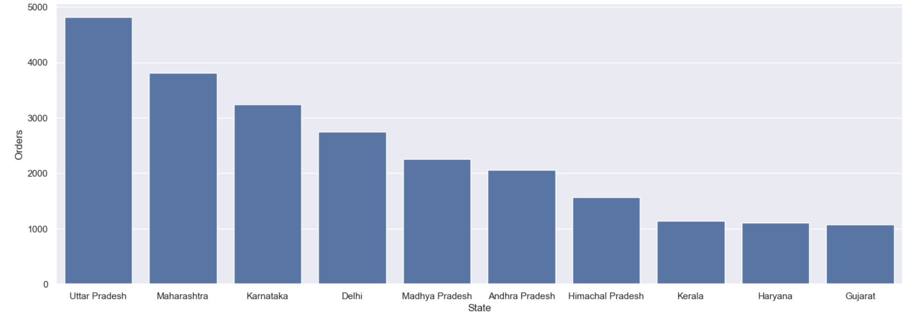
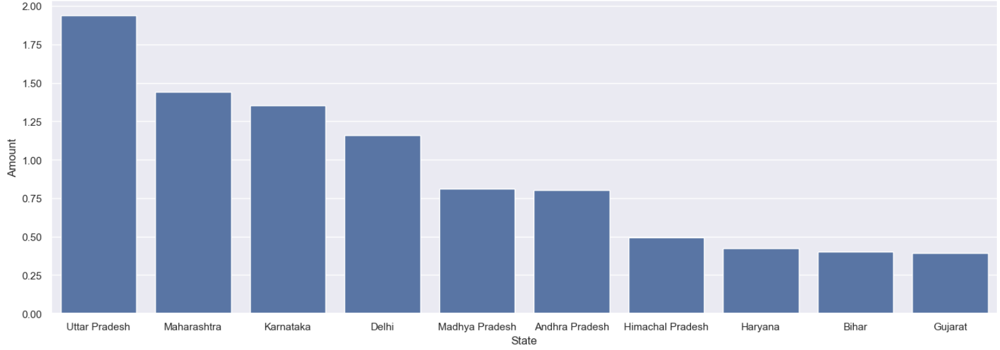

# 🎇 Diwali Sales Analysis | Python EDA Project

## 📌 Project Overview
This project performs Exploratory Data Analysis (EDA) on Diwali sales data to understand customer purchasing behavior during the festive season.

## 🛠 Tools & Libraries Used
- Python
- Pandas
- NumPy
- Matplotlib
- Seaborn

## 📊 Key Visual Insights

### Gender-wise Sales

### Age Group vs Gender

### Age Group vs Sales

### Marital Status Analysis

### Product Category Sales

### Top States by Orders

### 7️⃣ Top 10 States by Sales Amount

## 📂 Dataset
Diwali Sales dataset (CSV format)

## 🚀 Conclusion
- Female customers contribute higher sales during Diwali  
- Most purchases come from the 26–35 age group  
- Certain states dominate festive sales  
- Electronics and clothing categories perform the best  

## 👤 Author
**Saurabh**
